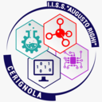

Welcome! I’m Salvatore Galeotta, a **.NET backend & game developer** with 3+ years of professional experience building scalable, maintainable software.

I specialize in building high-performance **REST APIs** using **C#** and **.NET** 8+, applying clean architecture and **SOLID** principles to ensure long-term reliability. I work with **Entity Framework** in a **Database-First** setup, evolving existing schemas with a focus on maintainability and performance, and I also integrate **AWS services** such as **S3** and **Lambda** when cloud-based scalability and automation are required.

On the **Unity** side, I’ve contributed to production-ready applications by fixing critical bugs, improving build stability, and enhancing performance and user experience.

Earlier in my career, I led the development of a vehicle customization system in **Unreal Engine 5** — a high-risk solo project that taught me how to quickly master new tools and deliver tangible results under pressure.

In my spare time, I enjoy game engine architecture and systems programming. I'm currently working on:

- [DeadFrame2D](https://github.com/Adamska-01/DeadFrame2D) — a **C++** 2D game engine powered by **SDL2**
- [Army’s Heaven](https://github.com/Adamska-01/Online_FPS) — an **online FPS** built in **Unity** using **PUN2** (**Photon Unity Networking**)

Whether building robust backend systems or experimenting with game tech, I care about writing clean, elegant code and continuously pushing my skills forward.

## Education

BSc (Hons) Computer Games Programming at [Solent University](https://www.solent.ac.uk/courses/undergraduate/computer-games-programming-and-design-bsc).

2019 - 2022

Electronics Diploma at [IISS Augusto Righi](https://www.iissrighi.it/indirizzo-di-studio/elettronica-ed-elettrotecnica/).

2010 – 2016

## Experience

### Backend Development (C# / .NET 8+)

- 3+ years building scalable REST APIs using .NET 8+, Entity Framework Core, and MySQL.
- Experienced in migrating legacy PHP and ASP.NET systems.
- Contributed to the design and early implementation of OAuth-based authentication flows.

### Game/App Development

- Commercial experience in Unity (C#) and Unreal Engine 5 (C++/Blueprints).
- Contributed to WebGL and iOS builds for OLS (Outdoor Living Solutions).
- Took ownership of the development of a vehicle customization system in Unreal Engine.
- Developed a variety of solo and collaborative projects in Unity, Unreal Engine, and C++.

### Frontend & Full-Stack (HTML, CSS, JS, PHP, SQL)

- Adequate experience from commercial projects and maintaining this website.

### Additional Skills

- Familiar with automating builds and CI/CD workflows using Bitbucket Pipelines and related tools.
- Assisted lead developers in recruitment processes, including candidate evaluations.
- Comfortable writing unit tests and working within Docker-based environments.
- Exposure to AWS cloud services and Agile/Scrum methodologies.

## Technologies & Tools

- REST APIs, Entity Framework Core
- Unity Engine, Unreal Engine 5
- Git, Jira, Docker, CI/CD pipelines
- Unit Testing
- Console Development (Unreal)
- Photon Unity Networking (PUN2)
- SDL2, Box2D, Premake
- AWS Cloud Services
- Agile/Scrum methodologies
- Basic 3D Modeling (3DSMax, Blender)
